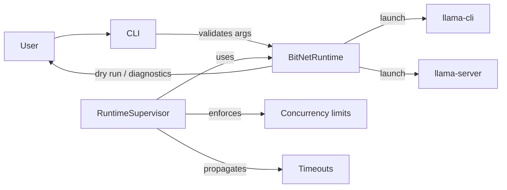

# Architecture Overview

_This document is generated from the repository source tree. Regenerate with_
```
python utils/generate_architecture_docs.py
```
_(see instructions below).

The BitNet runtime is intentionally thin: Python orchestration glues together
compiled llama.cpp binaries and BitNet-specific kernels. The diagrams below are
kept minimal so they match the present module layout.

## High-Level Stack

```mermaid
graph TD
    subgraph CLI
        A[run_inference.py]
        B[run_inference_server.py]
    end
    subgraph PythonRuntime
        C[bitnet.runtime\nBitNetRuntime]
        D[bitnet.supervisor\nRuntimeSupervisor]
    end
    subgraph NativeKernels
        E[src/ggml-bitnet-*.cpp]
        F[gpu/]
    end
    G[llama.cpp binaries\n(llama-cli / llama-server)]

    A --> C
    B --> C
    C --> G
    C --> E
    C --> F
    D --> C
```

## Runtime Interactions



## Generation Instructions

Run the helper to refresh this file:

```
python utils/generate_architecture_docs.py
```

The script verifies that the modules referenced above still exist and then
re-emits the diagrams. Update the script before the architecture diverges.
