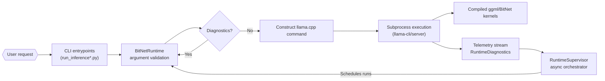
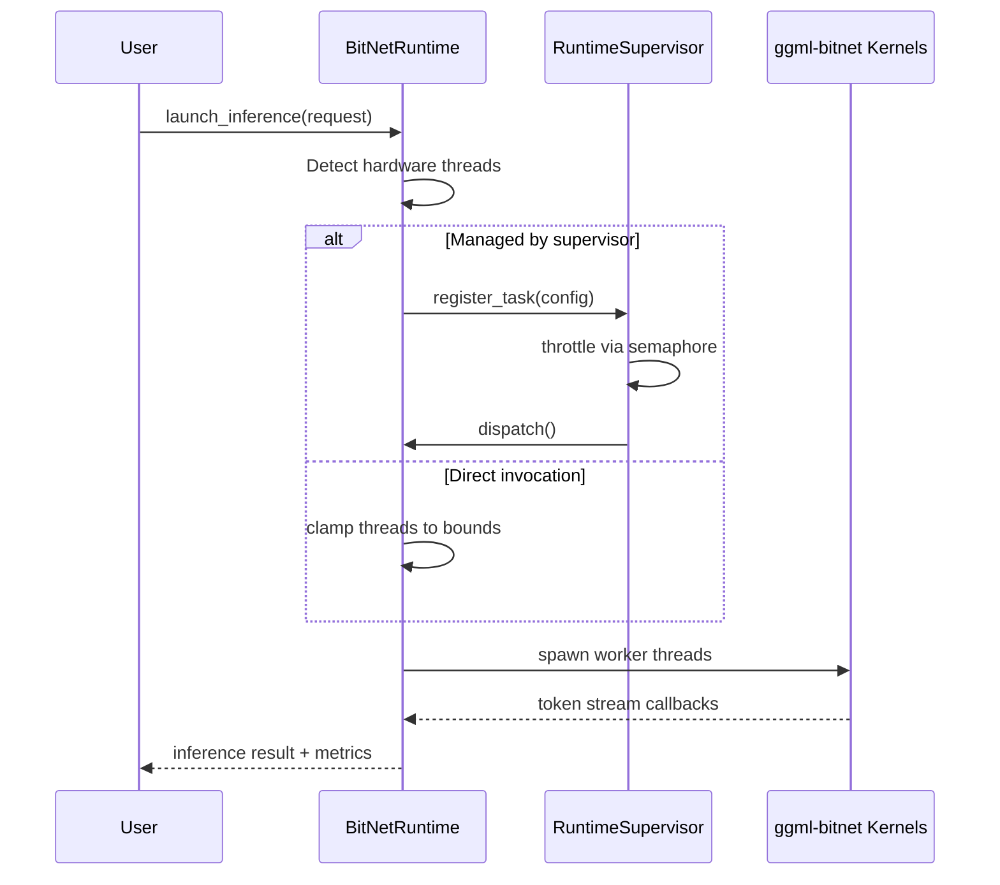

# System Requirements Document (SRD)

_Last updated: 2025-05-30_

## 1. Mission Statement
bitnet.cpp delivers high-performance inference for 1-bit and ternary LLMs on CPU and GPU targets. The system provides command-line tooling, runtime orchestration, and kernel implementations that make it possible to execute BitNet models efficiently on commodity hardware while remaining backwards compatible with llama.cpp workflows.

### Success Criteria
- End users can execute inference or start the HTTP server with a one-command setup on supported platforms.
- Runtime diagnostics clearly surface missing binaries, configuration issues, or model assets.
- Benchmarks demonstrate parity with documented speedups in the README and research papers.
- Documentation, tooling, and scripts remain synchronized and reproducible across CPU and GPU pathways.

## 2. Stakeholders & Personas
- **Model Engineers**: optimise kernels or add hardware backends.
- **ML Practitioners**: convert, benchmark, and run BitNet models locally or in the cloud.
- **Integrators**: embed BitNet runtime into orchestration platforms or services.
- **Contributors**: extend kernels, improve tooling, and maintain documentation.

## 3. System Context
bitnet.cpp layers Python utilities and CLI entry points on top of compiled C++ kernels derived from llama.cpp and BitNet-specific lookup table optimisations. External dependencies include:
- CMake toolchain for native builds (`ggml`, BitNet kernels).
- Python 3.9+ runtime for orchestration scripts and tooling.
- Optional CUDA/ROCm toolchains for GPU execution (documented in `gpu/README.md`).

The system interacts with the following artefacts:
- **Model files** in GGUF format (converted via `utils/convert-helper-bitnet.py`).
- **Compiled binaries** such as `llama-cli` and `llama-server`.
- **Configuration scripts** (`setup_env.py`, `utils/e2e_benchmark.py`).
- **Container artefacts** generated from `infra/docker/*.Dockerfile` and IaC
  modules under `infra/terraform/`.

## 4. Functional Requirements
### 4.1 Inference Execution
- Launch inference with configurable parameters (`prompt`, `n_predict`, `ctx_size`, `threads`, `temperature`, `batch_size`, `gpu_layers`).
- Provide dry-run capabilities that output the resolved command for inspection.
- Support diagnostics mode that reports environment readiness before execution.

### 4.2 Server Hosting
- Expose llama.cpp server mode through `BitNetRuntime.run_server` with validated arguments.
- Allow optional prompt priming for server bootstrapping.

### 4.3 Runtime Supervision
- Offer asynchronous orchestration through `RuntimeSupervisor` with concurrency limits, timeout handling, and structured telemetry (see `docs/runtime_supervisor.md`).

### 4.4 Tooling & Utilities
- Conversion of `.safetensors` checkpoints to GGUF via `utils/convert-helper-bitnet.py`.
- Benchmark generation with dummy model creation (`utils/generate-dummy-bitnet-model.py`) and execution (`utils/e2e_benchmark.py`).
- Environment bootstrapping for CPU/GPU builds using `setup_env.py`, which is
  now idempotent, cache-aware, and cross-platform.
- Container image definitions (`infra/docker/`) and Terraform modules
  (`infra/terraform/`) that implement turnkey deployment paths.

### 4.5 Testing & Quality Gates
- Python unit tests validate CLI argument parsing, runtime configuration guards, and command assembly (`tests`).
- Native kernels must build successfully through CMake targets defined in `CMakeLists.txt`.

## 5. Non-Functional Requirements
- **Performance**: Maintain or improve documented throughput multipliers on supported hardware.
- **Reliability**: Runtime diagnostics must flag missing artefacts before launch; failures surface actionable errors.
- **Portability**: Support x86 and ARM CPUs; GPU support via CUDA/ROCm builds.
- **Observability**: Provide structured diagnostics (`RuntimeDiagnostics.as_dict`) suitable for telemetry export.
- **Security**: Avoid executing unvalidated user input as shell commands; all subprocess launches use argument lists.
- **Usability**: CLI defaults should work for typical prompts without additional flags.

## 6. Architecture Overview
### 6.1 High-Level Components
| Component | Description |
| --- | --- |
| `src/ggml-bitnet-*.cpp` | Specialised lookup-table and multiply-add kernels extending `ggml` for ternary weights. |
| `bitnet.runtime.BitNetRuntime` | Python orchestration wrapper that validates configuration, constructs commands, and executes binaries. |
| `bitnet.supervisor.RuntimeSupervisor` | Async supervisor enabling multi-run scheduling and timeout control. |
| `run_inference.py` | User-facing CLI mapping arguments to `BitNetRuntime`. |
| `run_inference_server.py` | Convenience CLI for server mode operations. |
| `setup_env.py` | Bootstrapper ensuring dependencies and build artefacts are available. |
| `gpu/` | GPU kernels and build instructions. |

### 6.2 Data Flow



1. User invokes CLI (`run_inference.py` or `run_inference_server.py`).
2. Parser validates arguments and instantiates `BitNetRuntime`.
3. Runtime branches into diagnostics or execution path while constructing a llama.cpp-compatible command line.
4. Subprocess launches compiled binaries through the configured kernel backend; telemetry hooks publish structured events.
5. Optional `RuntimeSupervisor` schedules multiple runs with concurrency limits and aggregates telemetry for downstream dashboards.

### 6.3 Threading Model



Thread affinity is resolved at runtime: auto-detected cores are clamped by supervisor ceilings when orchestration is active. Kernel workers propagate backpressure via the telemetry stream if starvation is detected, ensuring the CLI surfaces actionable hints.

### 6.4 Kernel Math Pipeline

```mermaid
graph TD
    A[Quantised weights\n(ternary + LUT)] --> B[Dequant lookup\n(ggml-bitnet-lut.cpp)]
    B --> C[Mixed-precision matmul\n(ggml-bitnet-mma.cpp)]
    C --> D[Activation fusion\n(gelu/relu toggles)]
    D --> E[Residual accumulation]
    E --> F[Output token logits]

    subgraph CPU/GPU parity
        B
        C
    end
```

CPU and GPU kernels share lookup primitives, enabling release engineering to validate parity through shared regression suites. Instrumentation around `ggml-bitnet-mma.cpp` exports FLOP density and cache hit hints for observability consumers.

### 6.5 Orchestration Topology

```mermaid
flowchart TB
    subgraph Control Plane
        CLIProxy[CLI wrapper / API]
        Queue[Task queue]
        Supv[RuntimeSupervisor workers]
    end
    subgraph Execution Plane
        HostA[CPU host]
        HostB[GPU host]
    end
    subgraph Telemetry Plane
        Stream[Structured telemetry\n(JSONL, OTLP)]
        Dashboards[Dashboards\n(TUI/Web)]
    end

    CLIProxy --> Queue --> Supv
    Supv --> HostA
    Supv --> HostB
    HostA --> Stream
    HostB --> Stream
    Stream --> Dashboards
```

Supervisors run alongside queue consumers, feeding execution hosts that subscribe to shared telemetry. Optional dashboards, described in `docs/telemetry-dashboards.md`, subscribe to the same stream for real-time visibility.

### 6.6 Deployment Topologies
- **Local CPU**: Build via `setup_env.py --cpu` or manual CMake invocation; run CLI with GGUF model.
- **Local GPU**: Follow `gpu/README.md` instructions to compile CUDA/ROCm kernels and run CLI with `--gpu-layers`.
- **Service Integration**: Embed `BitNetRuntime` in orchestration services, using diagnostics and dry-run for health checks.
- **Container & Kubernetes**: Build from the published Dockerfiles and deploy via
  the Terraform module for managed clusters.
- **Edge Devices**: Use `setup_env.py` with caching enabled to provision native
  binaries and GGUF artefacts without container runtimes.

## 7. Module Reference Index

| Module | Key entry points | Responsibilities | Telemetry hooks |
| --- | --- | --- | --- |
| `bitnet.runtime.BitNetRuntime` | `run_inference`, `run_server`, `diagnostics` | Validate configuration, render llama.cpp commands, enforce thread bounds. | Emits `RuntimeDiagnostics` payloads with core/memory insights. |
| `bitnet.supervisor.RuntimeSupervisor` | `schedule`, `shutdown`, `active_tasks` | Async orchestration with concurrency gates, timeout enforcement, retry scaffolding. | Publishes scheduling events tagged with queue identifiers. |
| `run_inference.py` | CLI `main` | Parse CLI args, invoke runtime helpers, print telemetry snapshots. | Streams JSONL events when `--telemetry-out` is set. |
| `run_inference_server.py` | CLI `main` | Bootstrap llama.cpp HTTP server with guard rails (host binding, batch control). | Mirrors CLI telemetry schema for long-lived sessions. |
| `setup_env.py` | `main`, `BootstrapPlan` | Resolve toolchains, orchestrate builds, prime caches for CPU/GPU targets. | Records provisioning steps and duration counters. |
| `src/ggml-bitnet-*.cpp` | `ggml_bitnet_*` kernels | Implement ternary lookup tables, MMA pipelines, activation fusion across CPU/GPU. | Counters exported via `GGML_BITNET_TRACE` macros. |
| `gpu/` | CUDA/ROCm kernels, build docs | Provide accelerator parity and packaging notes. | GPU telemetry forwarded through runtime stream metadata. |

The module catalogue aligns with the documentation review checklist to ensure every release tracks functional ownership.

## 8. Configuration & Environment
- `setup_env.py` accepts flags to select CPU/GPU toolchains and optional clean builds.
- Environment variables inherited from host; advanced users may customise `PATH`, `LLAMA_*` settings through `BitNetRuntime`.
- Models stored relative to invocation path; diagnostics confirm presence if path supplied.
- Telemetry exporters are configured through the dashboard profiles defined in `docs/telemetry-dashboards.md`.

## 9. Roadmap Snapshot
Refer to `docs/system-roadmap.md` for the living roadmap and milestone tracking, including modernization, GPU parity, observability, and automation goals.

## 10. Open Risks & Assumptions
- GPU kernels may lag behind CPU feature parity; ensure documentation highlights gaps.
- Benchmark scripts assume availability of Python dependencies listed in `requirements.txt`.
- Large-model inference demands sufficient RAM; out-of-memory handling is delegated to llama.cpp binaries.

## 11. Compliance & Quality
- Licensing: MIT (root `LICENSE`).
- Code of Conduct and Security policy documented at repository root.
- Contributions should include tests where practical and update documentation referenced in this SRD.

## 12. References
- Technical report: <https://arxiv.org/abs/2410.16144>
- BitNet model release: <https://huggingface.co/microsoft/BitNet-b1.58-2B-4T>
- Runtime supervisor guide: `docs/runtime_supervisor.md`
- Deployment guide: `docs/deployment.md`
- Telemetry dashboards: `docs/telemetry-dashboards.md`
- Documentation checklist: `docs/documentation-review-checklist.md`
